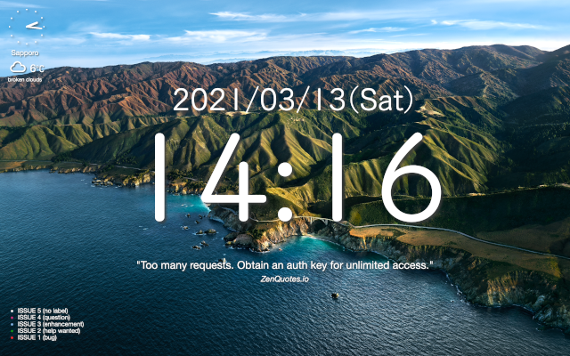

# uebersicht_widgets
Widgets of Übersicht (https://tracesof.net/uebersicht/)

## setup Übersicht

1. clone this repository
1. download and install Übersicht
1. launch Übersicht
1. set the cloned directory as the `Widgets Folder` of Übersicht
    - click the menu icon of Übersicht
    - select `Preferences...`
    - click `Widgets Folder` and select the cloned directory

## contained widgets

- `clock` : show current date and time
- `keywords`: shows random keywords from the O Level Computing Syllabus every 10 seconds

sample image:

## clock widget

### setup the clock widget

nothing needed

## weather widget

### setup the weather widget

- [OpenWeatherMap](https://openweathermap.org/)
    - create your account and get API key of free plan if you don't have
    - download [city.list.json.gz](http://bulk.openweathermap.org/sample/city.list.json.gz) and unzip it
    - find the city ID of your favourite city from city.list.json
- [WeatherIcons](https://erikflowers.github.io/weather-icons/)
    - download zipfile and unzip it
    - copy `weathericons-regular-webfont.ttf` from unzipped folder (`weather-icons-master/font`) to cloned directory
- weather widget
    - copy `weather.jsx.sample` as `weather.jsx`
    - change values of `city_id` and `api_key` in `weather.jsx`

### customize the weather widget

- use fahrenheit instead of celsius as the unit of temperature
    - change the value of `unit_api` as `imperial`
    - change the value of `unit_icon` as `\uf045`

## analog\_clock widget

### setup the analog\_clock widget

nothing needed

## github\_issues widget

the color of each bullet is the color of tha tag attach to the github issue

(if the github issue is untagged, the bullet color is white)

### setup the github_issues widget

- github.com
    - go [Developer settings](https://github.com/settings/apps) and create a personal access token
    - create new repository if you want
        - I created a new repository to use issues as a todo list
- github\_issues widget
    - copy `github_issues.jsx.sample` as `github_issues.jsx`
    - change values of `token`, `user` and `repo` in `github_issues.jsx`

## quote widget

### setup the quote widget

nothing needed

## Übersicht tips

- with default settings of Übersicht, you can't handle desktop icons well
    - click the menu icon of Übersicht
    - select `Preferences...`
    - off the check box of `Enable interaction`
